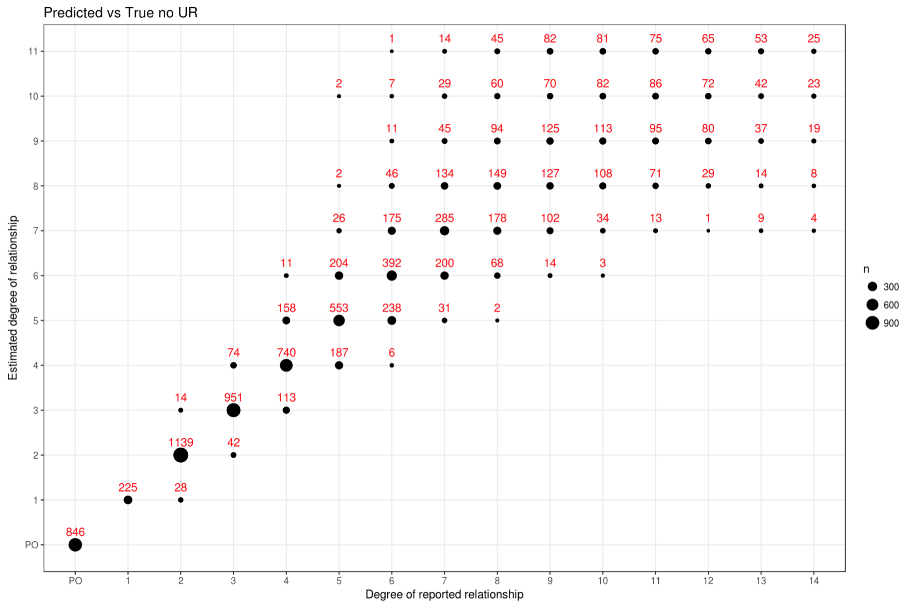

.. _sec-getting_started:

=======================================
Getting Started
=======================================

This section describes the analysis of an example dataset. We advise that you
run **TRIBES** on the example data first, to confirm you have installed  **TRIBES**
correctly. To run **TRIBES** on your own datasets, refer to instructions from
:ref:`sec-installation` onwards.

*TRIBES* requires a 64-bit version of Linux, MacOS or Windows 10, and
about 10GB of free disk space for software, reference and example data.
Install **TRIBES** using one of the methods described in the
:ref:`sec-installation` section.

Alternativelly you can run **TRIBES** froma pre-packaged docker image
using ``docker`` or ``singularity`` (see: :ref:`sec-containers`
section).

After installation return to `Testing installation on example dataset`_

.. _subsec-getting_started-testing_installation_on_example_dataset:

Testing installation on example dataset
---------------------------------------

To demonstate how **TRIBES** works we will use an example dataset (TFCeu)
with reference data from 1000 Genomes 'EUR' superpopulation
(REF-G1K\_EUR).

Create and navigate to a directory for reference and sample data, e.g
``$HOME/tribes-data``

::

    mkdir -p $HOME/tribes-data
    cd $HOME/tribes-data

Download and uncompress refecence data (1.2 GB)

::

    wget https://s3-ap-southeast-2.amazonaws.com/csiro-tribes/downloads/reference/1.0/REF_G1K-EUR_0.001.tar.gz
    tar -xzf REF_G1K-EUR_0.001.tar.gz
    rm REF_G1K-EUR_0.001.tar.gz  (optionally)

The reference data is subset of 1000 genomes dataset with unrelated
'EUR' inviduals and it's used in various stages of preprocessing (e.g.
LD pruning, phasing and filtering on MAF).

Download and uncompress example data (390 MB)

::

    wget https://s3-ap-southeast-2.amazonaws.com/csiro-tribes/downloads/examples/0.1/TFCeu.tar.gz
    tar -xzf TFCeu.tar.gz
    rm TFCeu.tar.gz  (optionally)

The sample data is a synthetic pedigee created from unrelated 1000
Genomes 'CEU' individuals. For more info on the dataset see the
:ref:`sec-installation` section. Inside the ``TFCeu`` directory you
will find the following files:

-  ``TF-CEU-15-2.vcf.gz`` - the source multisample VCF files
-  ``TF-CEU-15-2.true.rel`` - the true pariwise relations
-  ``g1k_ceu_family_15_2.ped`` - pedigee
-  ``config.yaml`` - the configuration file describing the steps taken
   in **TRIBES** pipeline.

The ``config.yaml`` provides configuration for the pipeline defining the
location and name of reference data and the true relations file, as well
as the name of the input VCF file and the preprocessing steps required
prior to IBD/relatedness estimation, e.g.:

::

    rel_sample: "TF-CEU-15-2_BiSnp_MAF:0.01_LD"

identifies ``TF-CEU-15.vcf.gz`` as the input file and applies 3
pre-processing steps: filtering on biallelic SNPs and a minor allele
frequence (MAF) of 0.01 plus LD pruning. All steps that can be used in
*TRIBES* pipeline are described below in `Preparing a custom
pipeline <#Preparing-a-custom-pipeline>`__

Note: Please note that the IBD estimation requires a phased VCF file. If
the input file is not phased, pre-processing must include phasing
(usually last the last step, after filtering), e.g.
``TF-CEU-15-2_BiSnp_MAF:0.01_LD_PH`` (where 'PH' in the file name
indicates to phase without reference) or
``TF-CEU-15-2_BiSnp_MAF:0.01_LD_RPH`` (with 'RPH' in the filename
indicates to phase with reference). This is not required in this example
becasue the input VCF is phased.

To run from a local installation do to your **TRIBES** installation
directory and run **TRIBES** with:

::

    ./tribes -d $HOME/tribes-data/TFCeu -j <no_cpu_cores> estimate_degree_vs_true

To run using ``docker``:

::

    docker run -it -rm -v "$HOME/tribes-data:$HOME/tribes-data" docker.io/piotrszul/tribes:0.1.1 -d $HOME/tribes-data/TFCeu -j <no_cpu_cores> estimate_degree_vs_true

To run using ``singularity``:

::

    singularity run -e  docker://docker.io/piotrszul/tribes:0.1.1 -d $HOME/tribes-data/TFCeu -j <no_cpu_cores> estimate_degree_vs_true

Where ``no_cpu_cores`` is the number of CPU cores to use.
``estimate_degree_vs_true`` calls **TRIBES** to perform all relatedness
estimation steps described in ``IBD/Relatedness steps:`` under
:ref:`subsec-usage-preparing_a_custom_pipeline`.

It takes about 20 minutes to to run the entire pipeline using 4 cores.

TRIBES output for example dataset
---------------------------------

Upon the sucessful completion, you can find the final and intermediate
stages of the pipeline in ``$HOME/tribes-data/TFCeu/`` (~2.3GB). In
particular:

-  ``TF-CEU-15-2_BiSnp_MAF:0.01_LD_PH_GRM-allchr_FPI_IBD.csv`` -
   includes the pairwise estimate of the degree of relatednes
   (``EstDegree``)
-  ``TF-CEU-15-2_BiSnp_MAF:0.01_LD_PH_GRM-allchr_FPI_IBD_RVT.html`` -
   notebook which compares estimated degrees vs the reported (true)
   ones.

The estimated relatedness is in CSV format with the following columns
and data:

::

    Id1,Id2,IBD0.cM,IBD1.cM,IBD2.cM,EstDegree
    NA07347,NA11919,0.999073851764529,NA,NA,11
    NA12058,NA12829,0.999107459568523,NA,NA,11

To see the comparison results you can open the report in your preferred
browser (e.g. ``firefox``):

::

    firefox $HOME/tribes-data/TFCeu/TF-CEU-15-2_BiSnp_MAF:0.01_LD_PH_GRM-allchr_FPI_IBD_RVT.html

The comparision is presented in the form of a dot chart like this:

